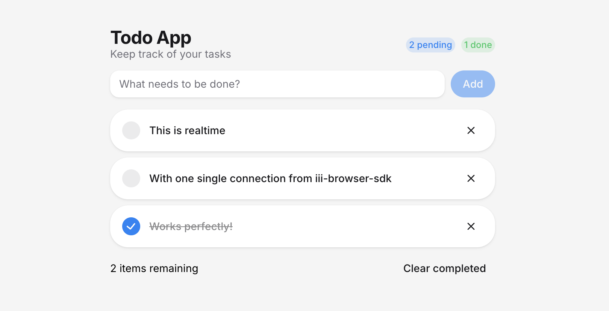

# Todo App — Real-time with iii

A real-time todo application built with [iii](https://iii.dev), demonstrating how the browser becomes a first-class worker connected to the engine via a single WebSocket.



## Architecture

```
┌─────────────────────┐        WebSocket         ┌──────────────────┐
│   React + HeroUI    │◄──────────────────────────►   iii Engine     │
│   (iii-browser-sdk) │       port 3111           │                  │
│   Browser Worker    │                           │  ┌────────────┐  │
└─────────────────────┘                           │  │ RBAC       │  │
                                                  │  │ Streams    │  │
┌─────────────────────┐        WebSocket          │  │ OTel       │  │
│   Node.js API       │◄──────────────────────────►  └────────────┘  │
│   (iii-sdk)         │       port 49134          │                  │
│   API Worker        │                           └──────────────────┘
└─────────────────────┘
```

The app consists of two workers connected to the same iii engine:

- **API Worker** (`apps/api`) — A Node.js backend that registers CRUD functions and manages todo data through iii Streams.
- **Browser Worker** (`apps/website`) — A React frontend using `iii-browser-sdk` that registers its own functions, triggers backend functions, and receives real-time stream updates — all over a single WebSocket connection.

## Features Used

### 1. Worker Registration

Both the server and browser register as workers with the iii engine using `registerWorker`:

**Server** (`apps/api/src/iii.ts`):

```typescript
import { Logger, registerWorker } from 'iii-sdk'

const iii = registerWorker('ws://localhost:49134', {
  workerName: 'api-worker',
})
```

**Browser** (`apps/website/src/lib/iii.ts`):

```typescript
import { registerWorker } from 'iii-browser-sdk'

const iii = registerWorker('ws://localhost:3111')
```

### 2. Remote Functions

The API worker registers functions that can be invoked by any other worker (including the browser). Each function has a namespaced ID like `todos::create`:

```typescript
fn(
  'todos::create',
  async (req: { title: string }): Promise<Todo> => {
    const id = crypto.randomUUID()
    const result = await todosStream.set({
      group_id: 'todos',
      item_id: id,
      data: { id, title: req.title, completed: false },
    })
    return result.new_value
  },
  { description: 'Create a new todo' },
)
```

Registered functions: `todos::create`, `todos::list`, `todos::get`, `todos::toggle`, `todos::delete`.

### 3. Function Invocation (`trigger`)

The browser calls backend functions directly using `iii.trigger()` — no REST endpoints, no fetch calls:

```typescript
const { items } = await iii.trigger<{}, { items: Todo[] }>({
  function_id: 'todos::list',
  payload: {},
})
```

### 4. Streams (Real-time State)

Todos are stored in an iii Stream — a persistent, observable data structure backed by a file-based KV store. The `TodoStream` class wraps stream operations (`get`, `set`, `list`, `update`, `delete`):

```typescript
export class TodoStream implements IStream<Todo> {
  async set(args) {
    return iii.trigger({ function_id: 'stream::set', payload: { ...args, stream_name: 'todo' } })
  }
  // get, list, update, delete...
}
```

When any stream data changes, the engine automatically pushes the change event to all subscribers.

### 5. Stream Triggers (Real-time Updates in the Browser)

The browser registers a function and binds a `stream` trigger to it. Whenever a todo is created, updated, or deleted, the engine invokes this browser function in real time:

```typescript
const funcRef = iii.registerFunction({ id: 'ui::on-todo-change' }, async (input: StreamChangeEvent) => {
  switch (input.event.type) {
    case 'create':
      setTodos((prev) => [...prev, todo])
      break
    case 'update':
      setTodos((prev) => prev.map((t) => (t.id === input.id ? todo : t)))
      break
    case 'delete':
      setTodos((prev) => prev.filter((t) => t.id !== input.id))
      break
  }
  return {}
})

iii.registerTrigger({
  type: 'stream',
  function_id: funcRef.id,
  config: { stream_name: 'todo', group_id: 'todos' },
})
```

### 6. RBAC (Role-Based Access Control)

The public-facing worker on port `3111` has RBAC enabled. An auth function creates a session for each connecting browser client and controls what the client is allowed to do:

```typescript
fn('todo-project::auth-function', async (input: AuthInput): Promise<AuthResult> => {
  const sessionId = crypto.randomUUID()
  return {
    allowed_functions: [],
    forbidden_functions: [],
    allow_function_registration: true,
    allowed_trigger_types: ['stream'],
    function_registration_prefix: sessionId,
    // ...
  }
})
```

The engine config restricts which functions are exposed to browser clients:

```yaml
rbac:
  auth_function_id: todo-project::auth-function
  expose_functions:
    - match("todos::create")
    - match("todos::list")
    - match("todos::get")
    - match("todos::delete")
    - match("todos::toggle")
```

### 7. OpenTelemetry (Observability)

The engine has built-in OpenTelemetry support for traces, metrics, and logs — configured via `iii-config.yaml`:

```yaml
- class: modules::observability::OtelModule
  config:
    enabled: true
    service_name: iii-test
    metrics_enabled: true
    logs_enabled: true
    sampling_ratio: 1.0
```

### 8. Structured Logging

The API worker uses the iii `Logger` for structured log output:

```typescript
import { Logger } from 'iii-sdk'
const logger = new Logger()

logger.info('Toggling todo', { id: req.id })
logger.warn('Todo not found', { id: req.id })
```

## Using `iii-browser-sdk`

This project uses [`iii-browser-sdk`](https://www.npmjs.com/package/iii-browser-sdk) (`v0.10.0-beta.2`) to turn the React frontend into a full iii worker running in the browser. The browser SDK provides the same API as the server SDK (`registerFunction`, `trigger`, `registerTrigger`) but with zero Node.js dependencies and a browser-native WebSocket transport.

**Key resources:**

| Resource                  | Link                                                                                     |
| ------------------------- | ---------------------------------------------------------------------------------------- |
| npm package               | [npmjs.com/package/iii-browser-sdk](https://www.npmjs.com/package/iii-browser-sdk)       |
| Documentation             | [iii.dev/docs](https://iii.dev/docs)                                                     |
| Browser guide             | [Use iii in the Browser](https://iii.dev/docs/how-to/use-iii-in-the-browser)             |
| Browser SDK API reference | [iii.dev/docs/api-reference/sdk-browser](https://iii.dev/docs/api-reference/sdk-browser) |
| Server SDK (iii-sdk)      | [npmjs.com/package/iii-sdk](https://www.npmjs.com/package/iii-sdk)                       |
| iii Engine                | [github.com/iii-hq/iii](https://github.com/iii-hq/iii)                                   |
| Examples                  | [github.com/iii-hq/iii-examples](https://github.com/iii-hq/iii-examples)                 |

**Imports used in this project:**

| Import                   | Purpose                                                                 |
| ------------------------ | ----------------------------------------------------------------------- |
| `iii-browser-sdk`        | Core SDK — `registerWorker` to connect to the engine                    |
| `iii-browser-sdk/stream` | `StreamChangeEvent` type for handling real-time stream updates          |
| `iii-sdk`                | Server-side SDK — `registerWorker`, `Logger`, `AuthInput`, `AuthResult` |
| `iii-sdk/stream`         | Server-side stream types — `IStream`, `StreamSetInput`, etc.            |

## Setup

### Prerequisites

- **Node.js** >= 22.12.0
- **pnpm** 10.33.0+ (managed via `packageManager` field)
- **Vite+** (`vp`) — install globally with `npm i -g vite-plus`
- **iii Engine** — install from [github.com/iii-hq/iii](https://github.com/iii-hq/iii)
- **Bun** — used to run the API worker (`bun run --watch`)

### 1. Install dependencies

```bash
vp install
```

### 2. Start the iii engine

From the `apps/api` directory, start the engine with the project config:

```bash
cd apps/api
iiii --config iii-config.yaml
```

This boots the engine with:

- **Internal worker port** on `49134` (for the API worker)
- **Public worker port** on `3111` with RBAC (for browser clients)
- **Stream module** on `3112` with file-based KV persistence
- **OTel module** for observability
- **Exec module** that auto-runs `pnpm dev` to start the API worker

### 3. Start the website

In a separate terminal, from the root:

```bash
vp run dev
```

This starts the Vite dev server for the React frontend.

### 4. Open the app

Navigate to `http://localhost:5173` to see the todo app. Every change is reflected in real time across all connected browser tabs.

## Project Structure

```
todo-app/
├── apps/
│   ├── api/                    # Backend worker (Node.js + iii-sdk)
│   │   ├── iii-config.yaml     # iii engine configuration
│   │   ├── src/
│   │   │   ├── main.ts         # Entry point — imports all routes
│   │   │   ├── iii.ts          # Worker registration + logger
│   │   │   ├── lib/
│   │   │   │   ├── decorators.ts   # fn() helper for function registration
│   │   │   │   └── rbac.ts         # Auth function for browser RBAC
│   │   │   └── routes/
│   │   │       ├── todos.stream.ts   # TodoStream — wraps iii stream ops
│   │   │       ├── todos.create.ts   # Create a todo
│   │   │       ├── todos.list.ts     # List all todos
│   │   │       ├── todos.get.ts      # Get a todo by ID
│   │   │       ├── todos.toggle.ts   # Toggle completed status
│   │   │       └── todos.delete.ts   # Delete a todo
│   │   └── package.json
│   └── website/                # Frontend worker (React + iii-browser-sdk)
│       ├── src/
│       │   ├── App.tsx         # Todo UI (HeroUI + Tailwind)
│       │   ├── main.tsx        # React entry point
│       │   ├── hooks/
│       │   │   └── use-todos.ts    # Real-time todo state via iii
│       │   └── lib/
│       │       └── iii.ts          # Browser worker registration
│       └── package.json
├── package.json                # Monorepo root
├── pnpm-workspace.yaml         # pnpm workspace config
└── vite.config.ts              # Vite+ root config (lint, fmt)
```

## Tech Stack

| Layer         | Technology                                                       |
| ------------- | ---------------------------------------------------------------- |
| Engine        | [iii](https://iii.dev)                                           |
| Server SDK    | [iii-sdk](https://www.npmjs.com/package/iii-sdk)                 |
| Browser SDK   | [iii-browser-sdk](https://www.npmjs.com/package/iii-browser-sdk) |
| Frontend      | React 19, HeroUI, Tailwind CSS                                   |
| Tooling       | Vite+, pnpm, TypeScript                                          |
| API Runtime   | Bun                                                              |
| Observability | OpenTelemetry (built into iii)                                   |
